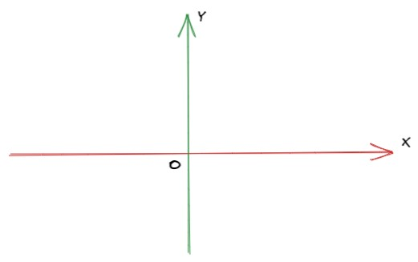
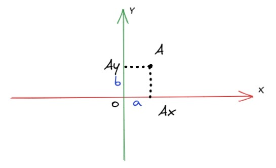
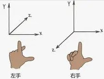

# 坐标系

虽然国内的初高中数学对坐标系的介绍已经非常详细了，而且坐标系大家已经非常熟悉了，但是为了内容的完整性，我还是会专门用一节内容带大家回顾下坐标系的概念。也会详细讲解直角坐标系和极坐标系的适用情况。

## 概述

**坐标系（coordinate system）**是我们在学校中开始学习几何时，第一个学到的东西。它为几何图形学中所有的东西（包括点、线、面等）赋予了一个坐标，有了坐标系我们可以通过文字和语言来描述顶点的位置即顶点的**坐标**。

坐标系的种类有很多，常用的坐标系包括[笛卡尔坐标系](https://baike.baidu.com/item/笛卡尔坐标系/4522878)、[平面极坐标系（简称极坐标系）](https://baike.baidu.com/item/平面极坐标系/422527)、[柱坐标系](https://baike.baidu.com/item/柱坐标系/8315492)和[球坐标系](https://baike.baidu.com/item/球坐标系/8315363)。不同的坐标系，虽然作用都是定位平面（或空间）上的某个顶点，但是在不同情况下使用合适的坐标系会极大简化计算的复杂度，例如我们想要计算平面上某一点在绕原点旋转一定角度后的顶点坐标，采用极坐标系会很方便的计算出结果，而处理计算某一点平移后的点时，采用直角坐标系会更方便计算。在本节的后面我会向大家详细介绍，笛卡尔坐标系和极坐标系。

你还可以自己定义一种坐标系，只要平面（或者空间）上的每个顶点都有一个唯一的坐标即可。

## 笛卡尔坐标系

在[教程首页](https://pengfeiw.github.io/)展示的两个坐标系模型就是笛卡尔坐标系，也称直角坐标系。

二维笛卡尔坐标系用来描述平面上的某一点的位置，包含一个**主轴**（后面称X轴）和**纵轴**（后面称Y轴），通常情况下X轴是水平方向的，从左指向右，Y轴是竖直方向的，从下指向上，X轴和Y轴的交点，称为该坐标系的原点（用O表示）。

假设平面中有一点A，A在X轴方向上的投影为Ax，A在Y轴上的投影Ay，Ax到原点O的距离为a，Ay到原点O的距离为b，那么点A的坐标为（a，b）。

扩展到三维，只需要在二维直角坐标系的基础上再添加一个坐标轴——**Z轴**，通常情况下，X轴、Y轴、Z轴是互相垂直的，但是可以通过一系列的变换，变成非垂直的情况（后面我会详细介绍坐标系变换的内容）。

三维坐标系中顶点的坐标由三个分量组成`(x, y, z)`，`x`和`y`的意义与二维坐标系的`x`、`y`相同，`z`类似，表示顶点在Z轴的投影点到原点的距离。

谈论到三维直角坐标系，经常会区分**左手坐标系**和**右手坐标系**。

> 在三维坐标中，根据Z轴(深)的不同方向，分为“右手系”和“左手系”两种坐标系。当轴的方向是（在一般二维直角坐标系上：向右为X轴，向上为Y轴）从眼前伸向深处时，该坐标系是左手系，反之则是右手系。

你一定见过类似如下的图。

