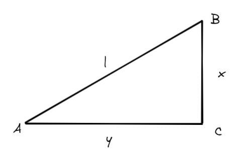
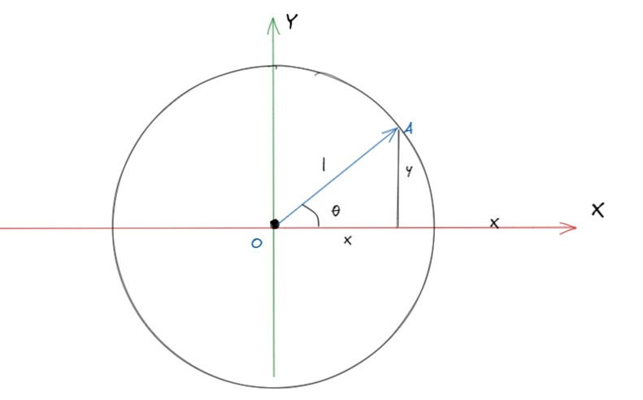
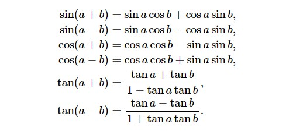
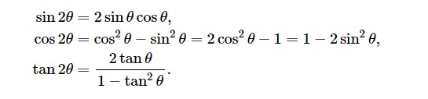
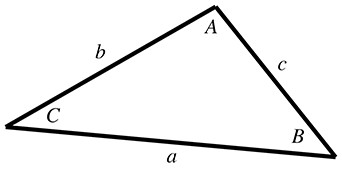
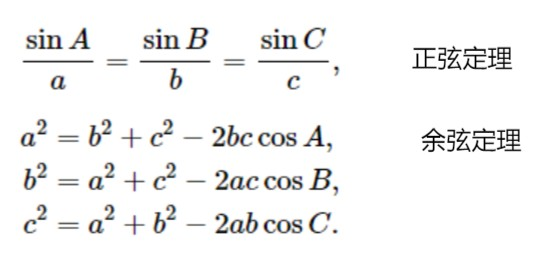

# 三角函数

**三角函数（trig functions）**，大家应该都不会陌生，想到三角函数，脑子里就会出现`sin`、`cos`、`tan`等词语，和一系列难以记忆的公式。虽然严格来说三角函数并不属线性代数这门学科，但是它在图形学中出现的频次实在太高了，所以不得不将其在这里介绍一下（写到这时，我正在想《你好，线性代数》这门教程的名字是否合适，不过暂时就这样吧）。

## 一. 基本三角函数

有一个直角三角形，如下。

三角形的三个角为A、B、C，直角边长为x和y，斜边长为l。

1. 正弦函数（sine ）

   正弦函数，等于与角对应的直角边长除以斜边长，以角A为例。
   $$
   sinA=\frac{x}{l}
   $$

2. 余弦函数（cosine）
   余弦函数，等于与角相邻的直角边长除以斜边长，以角A为例。
   $$
   cosA=\frac{y}{l}
   $$

3. 正切函数（tangent）

   正切函数，等于与角对应的直角边长除以与角相邻的直角边长，以角A为例。
   $$
   tanA=\frac{x}{y}
   $$
   
4. 正割函数（secant）

   正割函数，与余弦函数相反，等于斜边长除以与角相邻的直角边长。
   $$
   secA=\frac{l}{y}=\frac{1}{cosA}
   $$
   
5. 余割函数（cosecant）

   余割函数，与正弦函数相反，等于斜边长除以与角对应的直角边长。
   $$
   csc=\frac{l}{x}=\frac{1}{sinA}
   $$
   
6. 余切函数（cotangent）

   余切函数，与正切函数相反，等于与角相邻的直角边长除以与角对应的直角边长。
   $$
   cotA=\frac{y}{x}=\frac{1}{tanA}
   $$

## 二. 延伸公式

我们用单位圆来推导三角函数，单位圆就是半径为1的圆。如图有一个单位圆，原点为`O`，半径为1，有一条半径OA，A点的坐标为`(x, y)`，OA与x轴的夹角为*θ*

1. 平方公式 我们知道**勾股定理**。
   > 在一个直角三角形中，两个直角边的平方和等于斜边长的平方。
   > 所以将勾股定理带入到上图的单位圆中，得到：
   $$
   x^2+y^2=1
   $$
   因为，斜边长为1，所以有以下等式成立。
   $$
   sinθ=y 
    \\
   cosθ=x
   $$
   代入勾股定理，可以得到以下公式。
   $$
   sin^2θ +cos^2θ = 1
   $$

   通过同样的代入方式，我们也可以得到其他平方公式。
$$
\frac{1}{csc^2θ} + \frac{1}{cec^2θ} = 1
$$

2. 对称公式

   根据圆的对称性，有以下等式成立。
   $$
   sinθ=-sin (-θ)
   \\
   cos(θ)=cos(-θ)
   \\
   tan(-θ) = -tanθ
   $$
   

3. 和差公式

   下面的恒等式涉及对两个角的和或差取三角函数:

   

4. 二倍角公式

   下面的公式可以将二倍角转换为单倍角。

   

5. 正弦定理和余弦定理

   在已知边长和角度时，求解另一个未知边长或者角度时，可以使用正弦定理和余弦定理

   

   

