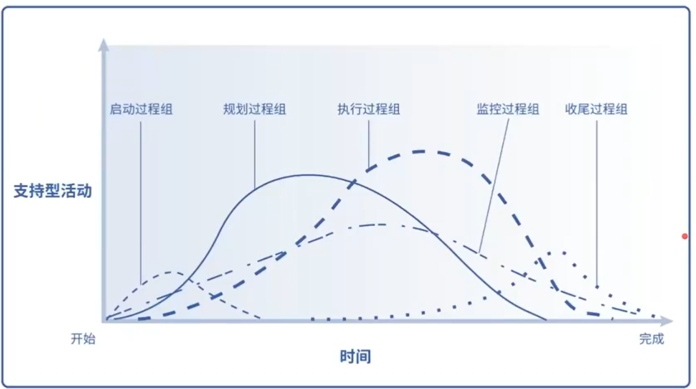

# 项目管理过程组

- 启动过程组
  - 授权

- 规划过程组
  - 

- 执行过程组
  - 根据规划来执行干活

- 监控过程组
  - 管绩效：
  - 管变更：

- 收尾过程组
  - 总结
  - 归档
  - 移交

PDCA 戴明环

PDCA 循环，又称**戴明环（Deming Cycle）**，是质量管理和持续改进中最经典的基石模型。它由统计学家休哈特（Walter Shewhart）提出，后由戴明博士（W. Edwards Deming）发扬光大。

简单来说，PDCA 是一个**螺旋式上升**的过程，每循环一次，质量或效率就提升一个台阶。

------

## 1. PDCA 的四个阶段

### **P - Plan（计划）**

这是最核心的阶段，决定了后续行动的方向。

- **分析现状：** 找出存在的问题或需要优化的点。
- **设定目标：** 目标应符合 SMART 原则（具体、可衡量、可达成、相关、有时间限制）。
- **寻找原因：** 挖掘影响结果的各种因素（常用鱼骨图或 5Why 分析法）。
- **制定方案：** 明确“谁、在什么时候、做什么、怎么做”。

### **D - Do（执行）**

将计划付诸实践。

- **具体实施：** 按照既定的方案和步骤开展工作。
- **记录数据：** 在执行过程中，详细记录相关数据和现象，为下一阶段提供证据。
- **人员培训：** 确保参与者理解计划并具备执行能力。

### **C - Check（检查）**

评估执行结果。

- **对比目标：** 将实际产出与预设目标进行对比。
- **寻找差距：** 看看哪些地方做到了，哪些地方没做到。
- **分析原因：** 思考为什么实际结果与计划存在偏差（是执行不到位，还是计划本身有误？）。

### **A - Act（处理/改进）**

这是 PDCA 的灵魂所在，体现了“持续改进”。

- **标准化：** 成功的经验要总结成标准、流程或制度，防止问题再次发生。
- **纠偏：** 失败的教训要分析，并针对未解决的问题，转入下一个 PDCA 循环。

------

## 2. PDCA 的四大特点

| **特点**       | **描述**                                                     |
| -------------- | ------------------------------------------------------------ |
| **周而复始**   | 它不是一个闭合的圆，而是一个不断往复的过程。                 |
| **逻辑统一**   | 大环带小环。组织的大目标是总环，各部门的小目标是子环，协同运转。 |
| **阶梯式上升** | 每次循环都会解决一部分问题，水平随之提高，像爬楼梯一样。     |
| **统计应用**   | 强调以事实为依据，利用数据说话，而非凭感觉判断。             |

